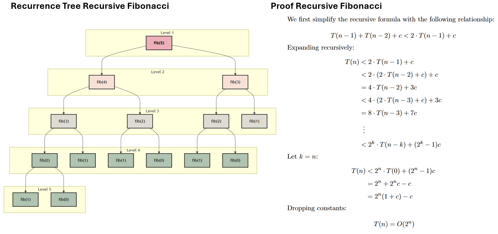
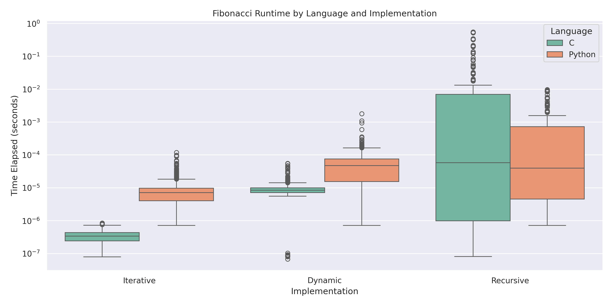

[](https://classroom.github.com/a/kdfTwECC)
# Midterm p1: Report on Analysis of Fibonacci  Series
* **Author**: Joshua Roberge
* **GitHub Repo**: https://github.com/CS5008Fall2025/midterm-report-jroberge16
* **Semester**: Fall 2025
* **Languages Used**: c, update
---
&nbsp;&nbsp;&nbsp;&nbsp; 
The purpose of this report is to gain an understanding of how a programming language and time complexity affect the performance of an algorithm. Using the programming languages Python and C, we will implement three versions of the Fibonacci sequence: iterative, recursive, and memoization. The Fibonacci sequence is a series that takes the previous two numbers in the sequence and then adds them together. This definition of the Fibonacci sequence can be expressed with the following formula: $f(n) = f(n-1) + f(n-2)$. Given the simplicity of the Fibonacci sequence, it is a perfect base algorithm to perform our analysis. This report will be organized into the following 3 sections: 

* __Big(O)-Analysis__: an analysis of the run time and space complexity of our Fibonacci implementations.
* __Empirical Analysis__: analyzing the experimental results of our algorithms. 
* __Language Analysis__: discussing our results and experiences with Python and C

## Big(O)-Analysis:
In this section, we will analyze each of our three Fibonacci implementations: iterative, recursive, and dynamic. To analyze each of these algorithms, we will explore their pseudocode, recursion tree, and perform a Big-O analysis.

### Iterative:

<p align="center">
  
  <br>
  <strong>Figure 1:</strong> Iterative Analysis [^7].
</p>

The pseudocode above outlines the iterative solution for the Fibonacci sequence. To find a T(n) for our code, we can analyze each line and count the number of operations:

* __Lines 2-8__:  These lines of code are a combination of variable assignments and simple conditionals which equate to constant time complexity. In total, there are four constant operations that are only performed once. We therefore assign this work a constant value of $4$

* __Lines 9-12__: here we perform a `for` loop that does $n-1$ iterations. During each iteration, we perform three operations and thus this work is equal to $3 \cdot(n-1)$.

* __Space Complexity__: for this code we find that our space complexity is $O(1)$. There are 3 variable assignments that are reused at every iteration.

Combining this information, we find the following equation for the iterative solution:

<br>
<p align="center">
$T(n)= c \cdot (n-1) + 4$
</p>
<br>


Given this information, we can now formally show that the iterative solution is $T(n) = O(n)$, the result of which is shown in the proof above. Overall, this algorithm is a simple yet very efficient implementation of the Fibonacci sequence. The space complexity is constant, and our time complexity is  $O(n)$[^7].

### Recursive Solution:
<p align="center">
  
  <br>
  <strong>Figure 2:</strong> Recursion Analysis.
</p>

__Pseudocode Code Recursive:__

```text
1.  FUNCTION recursive_fib(n):
2.      IF n <= 1:
3.          RETURN n
4.      result = recursive_fib(n - 1) + recursive_fib(n - 2)
5.      RETURN result
```
&nbsp;&nbsp;&nbsp;&nbsp; 
As shown in the pseudocode above, the recursive solution is a simple  algorithm to implement. In line 2 and 3, we check for our base cases, and then in line 4, we perform our recursive call. Although the recursive solution is simple to implement, a closer look at the recurrence tree reveals redundant and exponential growth.

&nbsp;&nbsp;&nbsp;&nbsp; 
The recurrence tree shows how our recursive calls quickly add to the stack memory. A literature review shows that the tight upper bound of the recursive solution is $O(\phi^n)$ [^4], but we are going to explore the more general approach of showing $O(2^n)$. Looking at the pseudocode, we check our base case, then perform two additional recursive calls. This equates to $T(n) = T(n-1) + T(n-2) + 1$, an exact replication of the Fibonacci formula. Given this information, we can prove that $T(n)$ is $O(2^n)$, which is shown above [^7].

&nbsp;&nbsp;&nbsp;&nbsp;
As shown in the proof,  our runtime for this solution is $O(2^n)$. Intuitively, this runtime makes sense; every recursive call results in about two additional recursive calls until our base case is satisfied. The recurrence tree also shows us our space complexity.  As we can see in the recurrence tree, our deepest branch is $n$ levels deep. Since only one branch within our tree can be on the stack at one given time, our total space complexity is $O(n)$[^7].

### Dynamic Solution
<p align="center">
  
  <br>
  <strong>Figure 3:</strong> Dynamic Analysis [^4].
</p>


&nbsp;&nbsp;&nbsp;&nbsp;
The above diagrams show our recurrence tree, proof, and pseudocode for the dynamic solution. The dynamic solution uses memoization, which results in a reduction in the number of calculations performed at the cost of space. As shown in the recurrence tree, this trade-off between space and time improves the overall efficiency of the algorithm.

&nbsp;&nbsp;&nbsp;&nbsp;
The recurrence tree shows a comparison between our recursive and dynamic solution. The ❌’s in the nodes represent calls we no longer need to make because their results were previously stored in our array `memo`, and thus the  dynamic solution only needs to make $n$ calculations. This results in a $T(n) = n + c$, where c represents constant work and base case checks. Using our $T(n)$ equation, we wrote a very simple proof showing that $T(n) = O(n)$ [^4].

&nbsp;&nbsp;&nbsp;&nbsp;
As previously mentioned, there is a trade-off between $S(n)$ and $T(n)$ when using memoization. Since we create an array that is $n$ large and our deepest branch is $n$ deep, we can say that our space complexity is $S(n) = O(n)$. This tradeoff seems minimal since we are reducing our time complexity from $O(2^n)$ to $O(n)$ while maintaining the same growth rate in our $S(n)$.

## Empirical Analysis:

<p id="fig4" align="center">
  
  <br>
  <strong>Figure 4:</strong> Experimental results for Fibonacci runtime and operation counts.
</p>

&nbsp;&nbsp;&nbsp;&nbsp;
In this section, we will review our experimental results with our different implementations of the Fibonacci sequence. For this experiment, we ran a total of 60 trials. Each trial calculated the Fibonacci sequence from 1 to 300, across each Language and algorithm type. In each trial, we tracked two metrics: operation count and runtime. Operation count tracked the number of calculations performed, while runtime tracked the total runtime of each sequence.


&nbsp;&nbsp;&nbsp;&nbsp;
The two graphs in [Figure 4](#fig4) show the experimental results; please note these will be referenced throughout our entire discussion. The first graph, "Fibonacci Runtime", tracks the runtime of each sequence. The solid lines in the graph show the average runtime, while the lightly colored bands show the total range of each sequence. The second graph, "Fibonacci Operation Counts," tracks the total operations for each sequence. Note that we provide no bands since operation counts will remain constant regardless of resource constraints. This Empirical Analysis discussion will be organized into three different sections:

* __1. [Big-O Comparison](#Big-O-Comparison)__: this section will compare each algorithm type to its [Big(O) analysis](#Big(O)-Analysis).
* __2. [Comparing Algorithm](#Comparing-Algorithms)__: This section will compare how iterative, dynamic, and recursive methods performed.
* __3. [Fibonacci Python Vs C](#Fibonacci-Python-Vs-C)__: This section will compare how Python and C performed across our experiment.

### Big O Comparison:

&nbsp;&nbsp;&nbsp;&nbsp;
In the [Big(O)-Analysis](#Big(O)-Analysis) section, we analyzed each algorithm and performed a Big-O analysis for both space and time complexity. Here, we will discuss how our results reflect our empirical data. Analyzing [Figure 4](#fig4), we find our Big-O Analysis is reinforced by our empirical results, but let us dive a little deeper.

* _Recursive_: Looking at our recursive solution we find a clear indication of exponential growth which matches our previous analysis showing $O(2^n)$. In fact, to complete our experiment, we had to stop calculating our recursive solutions much sooner than our dynamic and iterative solutions.

* _Iterative_: Our iterative solution had the best runtime overall. According to our $Big(O)$ analysis, we expect the iterative solution to have a runtime of $O(n)$, which is further validated by [Figure 4](#fig4) .

* _Dynamic_: According to our $Big(O)$ analysis, we expect the dynamic solution to have a runtime of $O(n)$ which is confirmed by operation counts in [Figure 4](#fig4). However, the actual runtime is not as smooth as we expected due to the overhead of the dynamic solution, but this will be discussed in the next section. 

### Comparing Algorithms:

&nbsp;&nbsp;&nbsp;&nbsp;
Looking at the results, we find our most performant algorithm was the iterative solution, while our worst algorithm was the recursive solution. These results were both validated by our [Big(O) analysis](#Big(O)-Analysis) and our experimental results. Although our Big-O Analysis and our experimental results agree with each other, our empirical results reveal information that our Big-O Analysis could not have revealed.

&nbsp;&nbsp;&nbsp;&nbsp;
Observing [Figure 4](#fig4), we find interesting nuances between the different Fibonacci implementations. Notably, our recursive solution for smaller Fibonacci values outperforms our dynamic solution. Our dynamic solution has the overhead of initializing an array of $n$, which our other implementations do not have to contend with.

&nbsp;&nbsp;&nbsp;&nbsp;
Another interesting take is to look at the variability between the different implementations. To measure variability, we used the population standard deviation on runtime and derived the following results:

$$\sigma_{\text{Recursive}} \,(1.41 \times 10^{-5}) \,>\, \sigma_{\text{Dynamic}} \,(2.54 \times 10^{-6}) \,>\, \sigma_{\text{Iterative}} \,(1.22 \times 10^{-7})$$

As shown, the recursion solution has significantly more variability compared to the other algorithms. Intuitively, this makes sense since we are performing more operations when compared to the other algorithms. A surprising result was that the dynamic implementation had more than 2000% more variability than the iterative solution. We believe this difference is derived from having to manage a large array. 

### Fibonacci Python Vs C


<p id="fig5" align="center">
  
  <br>
  <strong>Figure 5:</strong> Experimental results for Fibonacci runtime and operation counts.
</p>

&nbsp;&nbsp;&nbsp;&nbsp;
Figure 5 shows a box and whisker plot that compares our three algorithms based on programming language. This graph shows that on average Python generally performed more poorly and offered more variability in its final results. A notable exception to this observation comes from the recursive solution which seems to flip this pattern. This could be because we ran our recursive analysis deeper into the Fibonacci sequence for C than we did with Python.


## Language Analysis:

&nbsp;&nbsp;&nbsp;&nbsp;
In this section, we will analyze the nuances between Python and C, and describe our overall experience. The purpose of this discussion is to gain a deeper understanding of each language and, more importantly, define when and where to use each language. There will be three parts to this discussion; the first two sections will discuss each implementation separately, and then the last part will compare the two experiences.

### C Implementation

```c

void proccess_args(int argc, char *argv[], int *algorithm, int *print, int *fib_number){
    int opt;
    while ((opt = getopt(argc, argv, "f:hpa:")) != -1){
        switch(opt){
            case 'h':
                helper();
                exit(1);
            case 'a':
                ...
            case 'p':
                ...
            case 'f':
                ....
                *fib_number = atoi(optarg);
                break;
            default:
                break;
        }

```
&nbsp;&nbsp;&nbsp;&nbsp;
Overall, we found the C implementation easier to implement because it is designed for this type of work. There seemed to be far less head-scratching with C as compared to Python, but this will be discussed later on. To get the C implementation to work, we focused on three main areas: memory management, data types and command line arguments.

&nbsp;&nbsp;&nbsp;&nbsp;
The true power of C is derived from the fine-grained control that users have over its memory model. With this in mind, we paid special attention to how variables are declared and passed to our different Fibonacci algorithms. For the recursive and iterative solutions, we relied on passing by value instead of by reference. This proved convenient since we could rely on values simply popping off the stack. For our dynamic solution, our array was passed by reference and then used across all recursive calls [^5].

&nbsp;&nbsp;&nbsp;&nbsp;
Defining what data types to use proved trickier than expected. This analysis used an assortment of different data types, including int, long int, long long int, and finally uint64_t. Our final implementation used uint64_t, which is a 64-bit, unsigned integer. This experience taught us that you need to choose your variable types carefully and that C will not throw a red flag when you overflow. When we first created this program, we used the data type long int, which compiled fine and worked for low values of Fibonacci, but high values turned negative due to integer overflow [^5][^8].


&nbsp;&nbsp;&nbsp;&nbsp;
For this exercise, we also want to handle our command-line arguments with the `getopt()`, which is part of the `unistd.h` standard library. The code above demonstrates how we implemented this library and how it helped with our code. The key to this library comes from this string in the above code: `"f:hpa:"`. The arguments that have a `:` expect  a follow-up argument, while arguments that are not followed by a `:` are flag variables[^2]. Let's explain our command-line arguments in a little more detail:

* a: Algorithm number 1-4. This command requires a follow-on argument and is mandatory
* f: Fibonacci number. This requires a follow-up numeric value
* p: Flag variable for print that makes the program verbose
* h: Pulls up the help menu

Using this function helped us keep our code clean and made our code less complicated. We actually employed a similar library in our Python implementation, but we believe the C parsing library is a little more straightforward. 


### Python
<p id="fig5" align="center">

```python
import ABC

class FibonacciAlgorithm(ABC):
    def __init__(self, print_debug: bool = False):
        ...
    def time_it(self, n) -> tuple[int, float]:
        ...
    def _check_base_case(self, num) -> int:
        ...
    @abstractmethod
    def calculate(self, n: int) -> int:
        ...

class IterativeFib(FibonacciAlgorithm):
    def calculate(self, n):
        ...
```
<p>

&nbsp;&nbsp;&nbsp;&nbsp;
The Python programming language was specifically chosen because it stands in stark contrast to C when it comes to its level of abstraction. Unlike C, Python is a high-level language, so the fine-grained controls we have in C are not present in Python. What we wanted to specifically explore in Python was it object-oriented design, garbage collection, and how it handles data types.

&nbsp;&nbsp;&nbsp;&nbsp;
For our Python Fibonacci implementation, we used an object-oriented design approach, which significantly simplified the coding process . In the pseudocode above, you can see this object-oriented design approach in action. Our `IterativeFib` class contains our logic for our iterative solution, and this class inherits from our parent class `FibonacciAlgorithm`. The class `FibonacciAlgorithm` contains the methods and attributes used across all of our implementations of Fibonacci solutions. Additionally, we also have the abstract method `calculate` which all classes that inherit from `FibonacciAlgorithm` must override. While coding, we implemented several unforeseen changes, but implementing these changes was trivial because we used an object-oriented framework. Most changes we made came from the parent class, and because of this, our changes propagated down. Using an object-oriented design approach just made our code more maintainable, organized, and clean.

&nbsp;&nbsp;&nbsp;&nbsp;
In [Figure 4](#fig4), you will notice an odd jump in runtime for Python’s dynamic programming. This led to a deep dive into the inner workings of Python to figure out what happened. We have not been able to define the exact cause of the jump, but we have a leading theory as to why it is happening.  Python stores small integers as immutable objects, while larger integers use arbitrary precision. Arbitrary precision stores large integers in an array of digits in base $2^30$. For example, the integer fib(89) would be stored as $511172301 \cdot (2^{30})^0 + 583993188 \cdot (2^{30})^1 + 1 \cdot (2^{30})^2$. It is around this point that we switch from a 2 digit representation of our integers to a 3 digit representation of our integers, which leads to higher run times[^1].

&nbsp;&nbsp;&nbsp;&nbsp;
Garbage collection became an issue with our Python code when performing benchmarking. Originally, we would test all algorithms at once, starting with recursive, but our Python implementation seemed to be taking an unusual amount of time. Additionally, our dynamic and iterative solution didn’t seem to grow linearly (not shown in the graph). This led us to start counting operations, since the number of operations is deterministic and not dependent on available resources. From here, we suspected garbage collection may be the culprit, and then started forcing garbage collection after each Fibonacci calculation. In the end, we believe garbage collection helped, but it probably wasn’t our root cause. We believe the root cause had to do with the CPU working harder with larger values of the Fibonacci Sequence. This led us to start calculating each algorithm separately while putting break times between them. This seemed to remove much of the variability that we were initially seeing [^3].

### Python Vs C

&nbsp;&nbsp;&nbsp;&nbsp;
As previously mentioned, the core differences between the programming languages Python and C are the level of abstraction. Python is a high-level language and thus removes a lot of the onus on the developer to do things such as define variable types, manage memory, and other low level tasks. But this simplification in coding comes at a cost, and this is clearly shown when you compare our results from Python to C. Our empirical results clearly show that C was the more performant language. So in essence, functionally, C was the better programming language for the Fibonacci sequence, but one could argue that Python's ease of use, readability and other benefits outweigh the performance gain. 

&nbsp;&nbsp;&nbsp;&nbsp;
Python provides numerous features and functions that native C does not provide. First and most importantly, Python is an object-oriented language, and we leveraged this capability in our program, which resulted in code that was easier to read, write, and maintain. Additionally, in Python, we have to worry less about what specific variable types we are using. Simply put, Python is an easier language to quickly implement, but quick implementation is not everything. In this analysis, we ran into numerous hard-to-diagnose issues when working with Python. The level of abstraction in Python really did us a disservice when trying to implement our Fibonacci solutions. Our first issue was arbitrary precision, which Python dynamically uses for large integers. We believe this caused an increase in runtime for larger values of the Fibonacci sequences. The second issue we ran into was garbage collection. Meanwhile, the issues we dealt with in C were relatively minimal, and the issues we did run into were not buried in levels of abstraction.

&nbsp;&nbsp;&nbsp;&nbsp;
Overall, C was the better programming language for this _specific application_. A programming language is a tool, and we must always choose the right tool for the right job. Native C was the better choice over native Python, but what about things that are not native? One of the major benefits of Python is the numerous libraries it provides to its developers. These libraries, especially ones that are data-intensive, are usually implemented in another language, such as C. This provides developers with the speed benefit of a lower-level language with the ease of Python. We think in future experiments, we could see how the libraries of `NumPy`, `SciPy`, and `PyTorch` perform in our experiments.

# Conclusion

&nbsp;&nbsp;&nbsp;&nbsp;
Overall, this exercise was challenging, rewarding, and enlightening. I took two different programming languages and implemented three different algorithms for each of them. This hard work paid off, for I was able to see firsthand how the Big-O Analysis translated to empirical results, and it also demonstrated the pitfalls of using different programming languages. 

&nbsp;&nbsp;&nbsp;&nbsp;
The Big-O Analysis, in my opinion, was the most challenging. I really wanted to prove the actual run times of each of these algorithms, and this took research and a lot of careful thought. It was also rewarding to build the recursion trees because this allowed me to see how items got added to my call stack. I also took this opportunity to learn how to write pseudocode, which proved to be relatively straightforward.

&nbsp;&nbsp;&nbsp;&nbsp;
In the Empirical Analysis section, I analyzed the results of the experiments performed across our languages and algorithums. Setting up the experiments and building the graphs was a fun exercise. The Empirical results highlighted the nuances of the different languages I was using and clearly showed the fruitfulness of my Big-O Analysis.

&nbsp;&nbsp;&nbsp;&nbsp;
The language analysis really forced me to roll up my sleeves and dive deep into the inner workings of Python. Revealing how Python worked under the hood was fascinating. Reading about arbitrary precision and garbage collection gave me a newfound appreciation for the thinking behind building Python. This experience taught me when and where to use certain languages. Python may be easier and quicker to implement, but it's not necessarily the best solution. C showed the best results overall and had the least amount of issues. The abstraction layers built on top of Python made it really hard to figure out what was going on with our empirical results.

## References:
[^1]: Bhayani, A. (n.d.). How python implements super long integers?. 
Codementor. https://www.codementor.io/@arpitbhayani/how-python-implements-super-long-integers-12icwon5vk 

[^2]: GeeksforGeeks. (2018, September 10). Getopt() function in C to parse command line arguments. https://www.geeksforgeeks.org/c/getopt-function-in-c-to-parse-command-line-arguments/ 

[^3]: GeeksforGeeks. (2025, May 8). Garbage collection in Python. https://www.geeksforgeeks.org/python/garbage-collection-python/ 

[^4]: Lionell, A. (n.d.). Module 06: Dynamic Programming. Northeastern. https://northeastern.instructure.com/courses/225849/pages/overview-dynamic-programming 

[^5]: Lionelle, A. (n.d.). CS5008-Khoury/Labs. GitHub. https://github.com/CS5008-Khoury/Labs 

[^6]: Sahu, S. S. (2025, August 7). Inline function in C. GeeksforGeeks. https://www.geeksforgeeks.org/c/inline-function-in-c/ 

[^7]: Syed, R. (2021, February 21). Fibonacci iterative vs. Recursive. Medium. https://syedtousifahmed.medium.com/fibonacci-iterative-vs-recursive-5182d7783055 

[^8]: cppreference.com (2021, February 21). Fixed width integer types. cppreference. https://en.cppreference.com/w/c/types/integer.html


