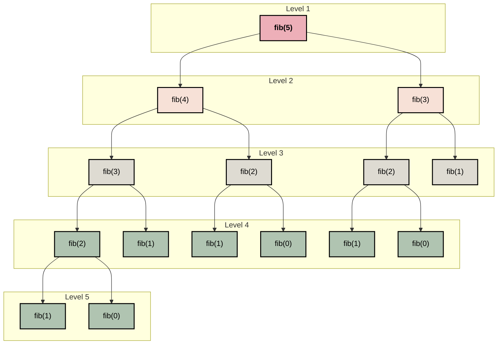
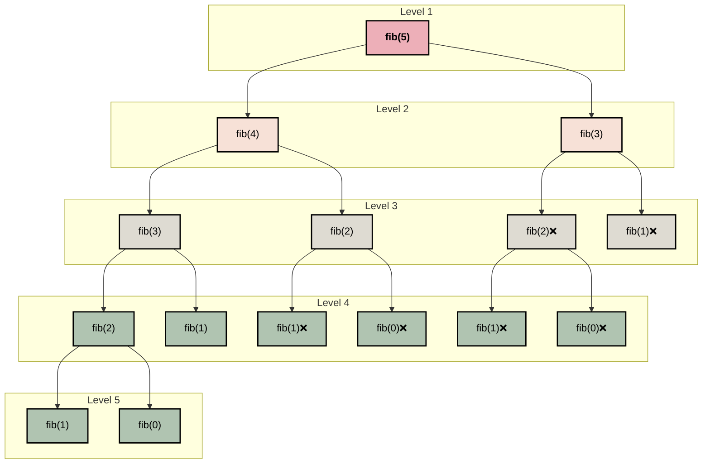

# Midterm: Fibonacci Analysis

Author: Joshua Roberge

Date: 10/10/25

---
&nbsp;&nbsp;&nbsp;&nbsp; 
The purpose of this report is to analyze different algorithmic implementations of the Fibonacci sequence and how these implementations vary across programming languages. To accomplish this, we will implement three versions of Fibonacci — iterative, recursive, and memoization — across two languages: Python and C. This report will be organized into the following five sections: overview, discussing the time and space complexity of our Fibonacci implementations; empirical results, analyzing the runtimes of each implementation; language analysis, discussing how our results varied across different programming languages; and discussion, a comparative discussion of all our results and experiences.


## Overview:
&nbsp;&nbsp;&nbsp;&nbsp; 
The Fibonacci sequence is a series which take at the previous two numbers in the series and then adds them together. This definition of the Fibonacci sequence can be expressed with the following formula:
$$
\begin{align*}
f(n) &= f(n-1) + f(n-2) 
\end{align*}
$$

Given the formula above, we note that the Fibonacci sequence is naturally a recursive algorithm, but the recursive solution is not necessarily the most efficient. We will now break down each of our approaches and discuss their runtime complexity.

### Iterative:
__Pseudocode Fibonacci iterative:__
```text
1.  FUNCTION iterative_fib(n):
2. 	 IF n == 0:
3.         		n 0
4.    	 ELSE IF fib_number == 1:
5.         		RETURN 1
6.    	 END IF
7.     	first_term = 0
8.     	second_term = 1
9.     	FOR i FROM 2 TO n:
10.        		calculation = first_term + second_term
11.        		first_term = second_term
12.        		second_term = calculation
13.    	END FOR
14.   	 RETURN calculation
```

The pseudocode above outlines the iterative solution for the Fibonacci sequence. To find a T(n) for our code, we can analyze each line and count the number of operations:
* __Lines 2-8__:  These lines of code are a combination of variable assignments and simple conditionals which equate to constant time complexity. In total, there are four constant operations that are only performed once. We therefore assign this work a constant value of $4$
* __Lines 9-12__: here we perform a `for` loop that does $n-1$ iterations. During each iteration we perform three operations and thus this work is equal to $3 \cdot n-1$.
* __Space Complexity__: for this code we find that our space complexity is $O(1)$. There are 3 variables assignments that are reused at every iteration.

Combining this information, we find the following equation for the iterative solution 

$$T(n)= c \cdot (n-1) + 4$$

Given this information, we can now formally prove that the iterative solution is $T(n) = O(n)$. 
https://syedtousifahmed.medium.com/fibonacci-iterative-vs-recursive-5182d7783055

__Proof Fibonacci iterative:__
>Let $T(n)$ be $O(n)$ if and only if $\exists c, \forall n \ge n_0$ such that $T(n)\le c \cdot g(n)$
>$$
\begin{align*}
c \cdot g(n) &\ge T(n) \\
c \cdot g(n) &\ge (n-1)*3 + 4 \\
c \cdot g(n) &\ge 3\cdot n - 3 + 4 \\
c \cdot g(n) &\ge 3\cdot n + 1 \\
\end{align*}
> $$
> We can now choose $c=4$ and $n_0=1$, by defintion prove that:
>
> $$ 3\cdot n + 1 \le 4 \cdot n $$
> $$ \therefore T(n) = O(n) $$


### Recusive Solution:
__Pseudocode Fibonacci Recursive:__
```text
1.  FUNCTION recursive_fib(n):
2.      IF n <= 1:
3.          RETURN n
4.      result = recursive_fib(n - 1) + recursive_fib(n - 2)
5.      RETURN result
```
__Recurence Tree for Fibonacci Recursive:__

&nbsp;&nbsp;&nbsp;&nbsp; 
Above we outline the pseudocode and recurrence tree for the recursive solution for the Fibonacci sequence. As we can see from the pseudocode code, the recursive solution is simple to implement. In line 2 and 3, we check for our base cases and line 4 we perform our recursive call. Although, the recursive solution at the surface may seem simple, exploring our recurrence tree reveals a different reality.

&nbsp;&nbsp;&nbsp;&nbsp; 
The recurrence tree shows how our stack calls break down with the fibnoci recursive solution. A literature review shows that the tight upper bound of the recursive solution is $O(\phi^n)$ (cite), but are going explore the more general approach of showing $O(2^n)$. Looking at the pseudocode, we check our base case then perform two additional recursive calls. This equates to $T(n) = T(n-1) + T(n-2) + 1$. With tshis information lets go on the show that $T(n)$ is $O(2^n)$. 
> __Proof Recursive__ 
> 
> We first simplify the recursive formula with the following relationship 
> $$T(n-1) + T(n-2) +c \lt 2 \cdot T(n-1) +c$$
> now we can expand this relationship. Let $n$ represent the fibonico number and $k$ represent the number of recurive expansions
> $$
> \begin{align}
&2 \cdot T(n-1) + c \\
&2 \cdot(2 \cdot T(n-2) + c ) + c \\
&4 \cdot T(n-2) + 3c \\
&4 \cdot (2 \cdot T(n-3) + c) + 3c \\
&\cdots \\
& 2^k \cdot T(n-k) + (2^k-1) \cdot c \\
\end{align}
> $$
>
> Let subsitute $k = n$<br>
>
>$$
\begin{align}
T(n) &= 2^n \cdot T(n-n) + (2^n -1) * c \\
&= 2^n \cdot T(0) + (2^n -1) * c \\
&= 2^n \cdot 1 + (2^n -1) * c \\
&= 2^n + 2^n \cdot c -c\\
&= 2^n (1 + c)-c\\
\end{align}
>$$
> We can now drop our constants and show:
> $$\therefore T(n) = O(2^n)$$
> (cite) https://syedtousifahmed.medium.com/fibonacci-iterative-vs-recursive-5182d7783055

&nbsp;&nbsp;&nbsp;&nbsp;
As we can see from the proof above our runtime for this solution is $O(2^n)$. Ituitivley this makes sense since our recursive calls allways grow by a factor two whihc is outlined in the recurence tree. The recurrence tree also shows us our space complexity. The As we can see in the reucrrence tree out deepest branch is $n$ levels deep. Since we only one branch within our tree can only be on the stack at one given time, our total space complexity is $O(n)$.

### Dynamic Solution

__Pseudocode Fibonacci Dynamic:__
```text
FUNCTION calculate_dyanmic_fib(n, memo):
    IF n <= 1:
        RETURN n
    IF memo[n] != 0:
        RETUNRN memo[n]
    memo[n] = calculate_dyanmic_fib(n-1, memo) + calculate_dyanmic_fib(n-2, memo)
    RETURN memo[n]

FUNCTION dynamic_fib(n):
    memo = [0] * n
    result = calculate_dyanmic_fib(n, memo):
    RETURN result
```
__Recursion Tree Fibonacci Dynamic:__

__Dynamic Proof:__
>Let $T(n)$ be $O(n)$ if and only if $\exists c, \forall n \ge n_0$ such that $T(n)\le c \cdot g(n)$. 
> 
> Our equation,
> $$T(n) = n + c$$
>We drop our constansts and choose $c=1$ and $n_0=1$, and prove by defintion that:
> $$ n \le n $$
> $$ \therefore T(n) = O(n) $$


&nbsp;&nbsp;&nbsp;&nbsp;
Above we show the recurrence tree and pseudocode for the Fibonacci dynamic solution. The pseudocode uses memoization which results in a reduction in the number of calculations performed at the cost space. As shown in the recurrence tree, this trade of between space and time improves the overall efficiency of the algorithm.

&nbsp;&nbsp;&nbsp;&nbsp;
Recurrence tree shows a comparison between our recursive and dynamic solution. The ❌’s in the nodes represent calls we no longer needed to make because their results were stored in our array `memo`. This results in a $T(n) = n + c$, where c represents the additional call it tries to make, but it immediately pops back up do to memoization. Using our $T(n)$ we wrote very simple proof showing that $T(n) = O(n)$ for our dynamic solution.

&nbsp;&nbsp;&nbsp;&nbsp;
As previsouly mentioned there is a trade off between $S(n)$ and $T(n)$ when using memomization. Since we create a an array that is $n$ large and our deepest branch is $n$, we can therefore say that $S(n) = 2(n) + c$. Dropping constant our space complexity is $S(n) = O(n)$. This tradeoff seems minimal since we our reducing our time complexity from $O(2^n)$ to $O(n)$ while maintaing the same growth rate in our space complexity.


## Empiracel Anlysis:


