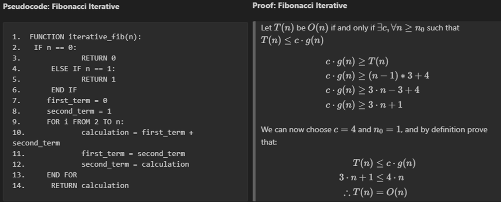
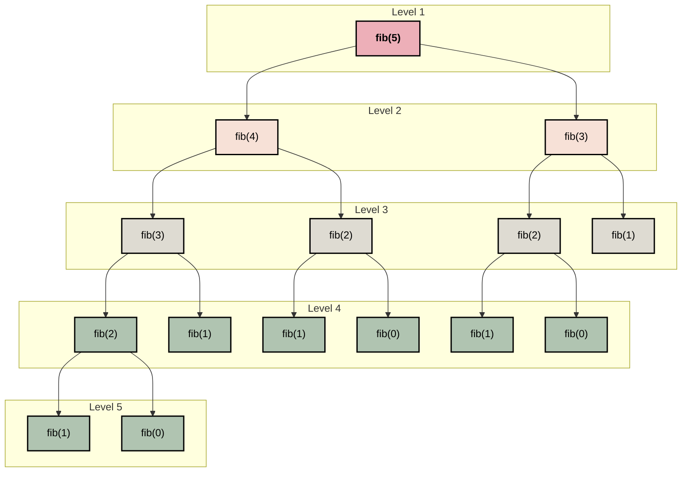
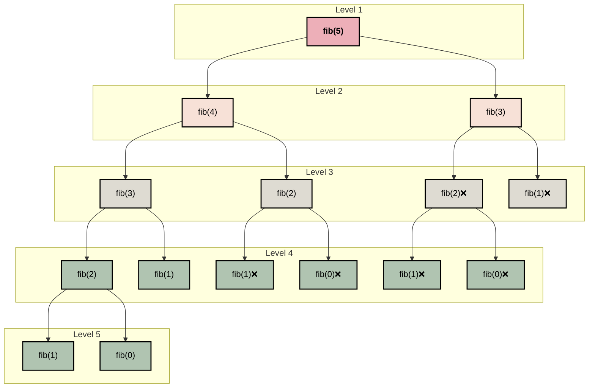

# Midterm: Fibonacci Analysis

Author: Joshua Roberge

Date: 10/10/25

---
&nbsp;&nbsp;&nbsp;&nbsp; 
The purpose of this report is to gain an understanding of how a programming language and time complexity effect performance a an algorithm. We will use the programming languages Python and C and with these languages we will implement three versions of the Fibonacci sequence: iterative recursive and memoization. The Fibonacci sequence is a series which takes the previous two numbers in the series and then adds them together. This definition of the Fibonacci sequence can be expressed with the following formula: $f(n) = f(n-1) + f(n-2)$. Given the simplicity of the Fibonacci serries, it makes it a perfect base algorithm to perform our analysis. This report will be organized into the following 4 sections: 

* __Big(O) Analysis__: an analysis of the run time and space complexity of our Fibonacci implementations.
* __Empirical Analysis__: analyzing the experimental results of our algorithms. 
* __Language Analysis__: discussing how our results, and experiences with our different programming languages


## Big(O) Analysis:


### Iterative:

<div style="text-align: center;">
  
  <figcaption>Figure 99: Experimental Results </figcaption>
</div>

The pseudocode above outlines the iterative solution for the Fibonacci sequence. To find a T(n) for our code, we can analyze each line and count the number of operations:
* __Lines 2-8__:  These lines of code are a combination of variable assignments and simple conditionals which equate to constant time complexity. In total, there are four constant operations that are only performed once. We therefore assign this work a constant value of $4$
* __Lines 9-12__: here we perform a `for` loop that does $n-1$ iterations. During each iteration we perform three operations and thus this work is equal to $3 \cdot n-1$.
* __Space Complexity__: for this code we find that our space complexity is $O(1)$. There are 3 variables assignments that are reused at every iteration.

Combining this information, we find the following equation for the iterative solution:
$$T(n)= c \cdot (n-1) + 4$$
Given this information, we can now formally prove that the iterative solution that $T(n) = O(n)$ which that result is shown above. Overall this is a simple yet very efficient implementation of the Fibonacci sequence. The space complexity is constant and our time complexity is  $O(n)$.
https://syedtousifahmed.medium.com/fibonacci-iterative-vs-recursive-5182d7783055

### Recursive Solution:


<div style="display: flex; gap: 20px; align-items: flex-start;">
<div style="flex: 1; transform: scale(0.); transform-origin: top left;">

__Recurrence Tree for Fibonacci Recursive:__


</div>
<div style="flex: 1;">

**Proof: Recursive Fibonacci**
> We first simplify the recursive formula with the following relationship:
> $$
> T(n-1) + T(n-2) + c \lt 2 \cdot T(n-1) + c
> $$
>
> Expanding recursively:
> $$
> \begin{align}
> &2 \cdot T(n-1) + c \
> &2 \cdot (2 \cdot T(n-2) + c) + c \
> &4 \cdot T(n-2) + 3c \
> &4 \cdot (2 \cdot T(n-3) + c) + 3c \
> &\cdots \
> &2^k \cdot T(n-k) + (2^k - 1) \cdot c
> \end{align}
> $$
>
> Let $k = n$:
> $$
> \begin{align}
> T(n) &= 2^n \cdot T(0) + (2^n - 1) \cdot c \
> &= 2^n + 2^n c - c \
> &= 2^n (1 + c) - c
> \end{align}
> $$
>
> Dropping constants:
> $$
> \therefore T(n) = O(2^n)
> $$
>
> *(Source: [Syed Tousif Ahmed, Medium](https://syedtousifahmed.medium.com/fibonacci-iterative-vs-recursive-5182d7783055))*

__Pseudocode Fibonacci Recursive:__
```text
1.  FUNCTION recursive_fib(n):
2.      IF n <= 1:
3.          RETURN n
4.      result = recursive_fib(n - 1) + recursive_fib(n - 2)
5.      RETURN result
```
</div>
</div>

&nbsp;&nbsp;&nbsp;&nbsp; 
Above we outline the pseudocode and recurrence tree for the recursive solution for the Fibonacci sequence. As we can see from the pseudocode code, the recursive solution is simple to implement. In line 2 and 3, we check for our base cases and line 4 we perform our recursive call. Although, the recursive solution at the surface may seem simple, exploring our recurrence tree reveals a different reality.

&nbsp;&nbsp;&nbsp;&nbsp; 
The recurrence tree shows how our stack calls break down with the fibnoci recursive solution. A literature review shows that the tight upper bound of the recursive solution is $O(\phi^n)$ (cite), but are going explore the more general approach of showing $O(2^n)$. Looking at the pseudocode, we check our base case then perform two additional recursive calls. This equates to $T(n) = T(n-1) + T(n-2) + 1$. With tshis information lets go on the show that $T(n)$ is $O(2^n)$. 


&nbsp;&nbsp;&nbsp;&nbsp;
As we can see from the proof above our runtime for this solution is $O(2^n)$. Ituitivley this makes sense since our recursive calls allways grow by a factor two whihc is outlined in the recurence tree. The recurrence tree also shows us our space complexity. The As we can see in the reucrrence tree out deepest branch is $n$ levels deep. Since we only one branch within our tree can only be on the stack at one given time, our total space complexity is $O(n)$.

### Dynamic Solution

__Pseudocode Fibonacci Dynamic:__
```text
FUNCTION calculate_dyanmic_fib(n, memo):
    IF n <= 1:
        RETURN n
    IF memo[n] != 0:
        RETUNRN memo[n]
    memo[n] = calculate_dyanmic_fib(n-1, memo) + calculate_dyanmic_fib(n-2, memo)
    RETURN memo[n]

FUNCTION dynamic_fib(n):
    memo = [0] * n
    result = calculate_dyanmic_fib(n, memo):
    RETURN result
```
__Recursion Tree Fibonacci Dynamic:__



__Dynamic Proof:__
>Let $T(n)$ be $O(n)$ if and only if $\exists c, \forall n \ge n_0$ such that $T(n)\le c \cdot g(n)$. 
> 
> Our equation,
> $$T(n) = n + c$$
>We drop our constansts and choose $c=1$ and $n_0=1$, and prove by defintion that:
> $$ n \le n $$
> $$ \therefore T(n) = O(n) $$


&nbsp;&nbsp;&nbsp;&nbsp;
Above we show the recurrence tree and pseudocode for the Fibonacci dynamic solution. The pseudocode uses memoization which results in a reduction in the number of calculations performed at the cost space. As shown in the recurrence tree, this trade of between space and time improves the overall efficiency of the algorithm.

&nbsp;&nbsp;&nbsp;&nbsp;
Recurrence tree shows a comparison between our recursive and dynamic solution. The ❌’s in the nodes represent calls we no longer needed to make because their results were stored in our array `memo`. This results in a $T(n) = n + c$, where c represents the additional call it tries to make, but it immediately pops back up do to memoization. Using our $T(n)$ we wrote very simple proof showing that $T(n) = O(n)$ for our dynamic solution.

&nbsp;&nbsp;&nbsp;&nbsp;
As previsouly mentioned there is a trade off between $S(n)$ and $T(n)$ when using memomization. Since we create a an array that is $n$ large and our deepest branch is $n$, we can therefore say that $S(n) = 2(n) + c$. Dropping constant our space complexity is $S(n) = O(n)$. This tradeoff seems minimal since we our reducing our time complexity from $O(2^n)$ to $O(n)$ while maintaining the same growth rate in our space complexity.


## Empirical Analysis:

<div style="text-align: center;">
  
  <figcaption>Figure 99: Experimental Results </figcaption>
</div>


&nbsp;&nbsp;&nbsp;&nbsp;
In this section we will review our experimental results with the different implementations of the Fibonacci sequence. These experiments consisted of a total of 60 trial. Each trial calculated the Fibonacci sequence 1 to 300, across each Language and algorithm type. In each trial we tracked two metrics: operation count and runtime. Operation counts tracked the number of calculation performed, while `runtime` tracked the total runtime of each sequence.


&nbsp;&nbsp;&nbsp;&nbsp;
The two graphs in figure 99 show the experimental results and these graphs will be referenced through this section. The first graph, "Fibonacci Runtime", tracks the runtime of each sequence. The solid lines in the graph shows the average runtime, while the lightly colored bands show the total range at each sequence. The second graph "Fibonacci Operation Counts" tracks the total operations for each sequence. Note that we provide no bands since operation counts will remain constant regardless of resources available. This Empirical Analysis will discussion will be organized into two different sections:

* __1. Big O Comparison__: this section will compare each algorithum type to the $Big(O)$ analysis in the previous section
* __2. Algorithms Comparison__: This section will compare how iterative, dynamic and recursive methods performed.
* __3. Language Comparison__: This section will compare how Python and C performed across our experiment.

### Big O Comparison:

&nbsp;&nbsp;&nbsp;&nbsp;
In the `Overview` section we analyzed each algorithum and performed a $Big(O)$ analysis for both space and time complexity. Here we will discuss how our results reflect our empirical data. Analyzing figure 99, we find our Big O analysis lines up with our empirical results, but lets dive a little deeper.

* _Recursive_: Looking ar our recursive solution we find a clear indication of exponential growth which matches our previous analysis showing $O(2^n)$. In fact, to complete our experiment, we had to stop calculating the recursive solutions sooner then our dynamic and iterative solutions.

* _Iterative_: Our iterative solution had the best runtime overall. According to our $Big(O)$ analysis, we expect the iterative solution to have a runtime of $O(n)$ which is further validated by figure 99.

* _Dynamic_: According to our $Big(O)$ analysis we expect the dynamic solution to have a runtime of $O(n)$. Looking at operation counts in figure 99, we see this is the case. Time complexity is not as smooth as we expected due to the overhead of the dynamic solution, but this will be discussed in the next section. 

### Comparing Algorithms:

&nbsp;&nbsp;&nbsp;&nbsp;
Looking at the results we find our most performant algorithm was the iterative solution, while our worst performing algorithm was our recursive solution. These results were both validated our big O analysis and our experimental results. Although our Big O analysis and our experimental results agree with each other, our empirical results reveal information that our Big O analysis could not have revealed.

&nbsp;&nbsp;&nbsp;&nbsp;
When looking at the time complexity graph in Figure 99, we find interesting nuances between the different Fibonacci implementations. One of the first things of note, is that our recursive solution for small values of fibonacci, outperforms our dynamic solution. Our dynamic solution has the overhead of initializing an array of $n$  which our other values do not have to contend with.

&nbsp;&nbsp;&nbsp;&nbsp;
Another interesting take is to look at the variability between the different implementations. To measure variability, we used population standard deviation for runtime and with this we found the following results:
$$\sigma_{\text{Recursive}} \,(1.41 \times 10^{-5}) \,>\, \sigma_{\text{Dynamic}} \,(2.54 \times 10^{-6}) \,>\, \sigma_{\text{Iterative}} \,(1.22 \times 10^{-7})$$
As shown, Recursion is significantly more variability compared to the other algorithms. Intuitively this makes sense since we are performing significantly more operations when compared to the other algorithms. A surprising result was that the Dynamic implementation which had 1976.45% more variability than iterative. I believe this difference is derived from have to manage a large array. 

### Fibonacci Python Vs C 


## Language Analysis:

&nbsp;&nbsp;&nbsp;&nbsp;
In this section we will analyzes the nuances between Python and C, and describe our overall experience. The purpose of this discussion to gain a deeper understanding of each language and more importantly define when and where to use each language. There will be three part to this discussion, the first two sections will discuss each implementation separately and then last part will compare the two experiences.

### C Implementation

&nbsp;&nbsp;&nbsp;&nbsp;
Overall, I found my C implementation easier implement because it is designed for this type of work. There seemed to be far less head scratching with C as compared to python, but this will be discussed later on. To get my C implementation to work I focused on two main areas: memory management and data types.

&nbsp;&nbsp;&nbsp;&nbsp;
The true power of C is derived from the fine grain control that users have over its memory model. With this in mind, this analysis paid special attention to how variables are declared and passed to our different Fibonacci algorithms. For the recursive and iterative solutions, we relied on passing by value instead of by reference. This proved convenient since we could rely on values simply popping off the stack. For our dynamic solution, our array was passed by reference and then used across all recursive calls.

&nbsp;&nbsp;&nbsp;&nbsp;
Defining what data types to use proved trickier than expected. This analysis used an assortment of different data types including int, long int, long long int and finally uint64_t. Our final implementation used uint64_t, which is a 64-bit, unsigned integer. Lessons learned in this experience are that you need to choose your variable types carefully, and that C will not throw a red flag when you overflow. When I first created this program, I used the variable long int which compiled fine and worked for low values of Fibonacci, but high values turned negative. This of course was caused by the integer overflowing and thus turning negative. 

https://www.codementor.io/@arpitbhayani/how-python-implements-super-long-integers-12icwon5vk

### Python

&nbsp;&nbsp;&nbsp;&nbsp;
The python programming language was specifically chosen because it stands in stark contrast to C when it comes to its level of abstraction. Unlike C, python is a high-level language, so the fine grain controls we have in C are not present python. What I wanted to specifically explore in python was object-oriented design, garbage collection and how it handles data types.

&nbsp;&nbsp;&nbsp;&nbsp;
For my python Fibonacci implementation. I went with an object-oriented design approach, and this made things significantly easier. While coding, I implemented several unforeseen changes, but implementing these changes were trivial because I used an object-oriented framework. Additionally, it just made the code easier to understand and naturally better organized.

&nbsp;&nbsp;&nbsp;&nbsp;
In figure 99 you will notice an odd jump in runtime for python’s dynamic programming. This caused a deep dive into the inner workings of python to figure out what happened. I have not been able to define the exact cause of the jump, but I have leading theory as to why it is happening. For small integers python stores these as immutable objects, while lager integers use arbitrary precision. Arbitrary precision stores large integers in an array of digits in base $2^30$. For example, the integer fib(89) would be stored as $511172301 \cdot 2^30^0 + 583993188 \cdot 2^30^1 + 1 \cdot 2^30^2$$. It is around this point that we switch from a two-digit representation of our integers to a 3 digit presentation of our integer which leads to higher run times.

&nbsp;&nbsp;&nbsp;&nbsp;
Garbage collection became an issue with my python code when performing benchmarking. Originally, I would test all algorithms at once starting with recursive, but my python implementation seemed to be taking an unusual amount of time. Additionally, my dynamic and iterative solution didn’t seem to grow linearly (not shown in the graph). This led me to start counting operations, since the number of operations is deterministic and not dependent on available resources. From here, I suspected garbage collection may be the culprit and then started forcing garbage collection after each Fibonacci calculation. In the end we believe garbage collection helped but probably wasn’t my root cause. We believe the root cause had to due with the CPU working harder with larger values of the Fibonacci Sequence. This led us to start calculating each algorithm separately while putting break times between them. This seemed to remove much of the variability that we were initially seeing.

### Python Vs C

&nbsp;&nbsp;&nbsp;&nbsp;
As previously mentioned, the core differences between the programming languages Python and C is the level of abstraction. Python is a high level language and thus removes a lot of the onus on the developer to do things such as define variable types, manage memory, and so much more. But this simplification in coding comes at a cost, and this is clearly shown when you compare our results from Python to C. Our empirical results in C clearly show that C was the more performant language. So in essence, functionally C was the better programming language for the Fibonacci sequence, but one could make the argument for forum over function. 

&nbsp;&nbsp;&nbsp;&nbsp;
Python provides numerous features and functions that native C does not provide. First and most importantly, Python is a object oriented language and we leveraged this capability in our program which resulted in code that was easier to read, write and maintain. Additionally in Python, we have to worry less about what specific variables types we are using. Simply put, Python is easier language to quickly implement, but quick implementation is not everything. In this analysis we ran into numerous hard to diagnose issues when working with Python. The level of abstraction in Python really did us a disservice when trying implement our Fibonacci solutions. Our first issue was arbitrary precision which Python dynamically uses for large integers. We believe this caused an increase in runtime in larger values of Fibonacci sequences. The second issue we ran into was garbage collection, so we think. Meanwhile, The issues we dealt with in C were relatively minimal, and the issues we did run into were not buried in levels of abstractions.

&nbsp;&nbsp;&nbsp;&nbsp;
Overall, C was the better programming language for this _specific application_. A programming language is a tool and we must always choose the right tool for the right job. Native C was the better choice over native Python, but what about things that are not native? One of the major benefits of Python is the numerous libraries it provides to its developers. These libraries, especially once our data intensive, are usually implemented in another language such as C. This provides developers with the speec benefit of a lower level language with the ease of use of python. I think in future experiments, we could see how the libraries of `numpy`, `SciPy` in `pytorch` perform in our experiments.

# Conclusion


