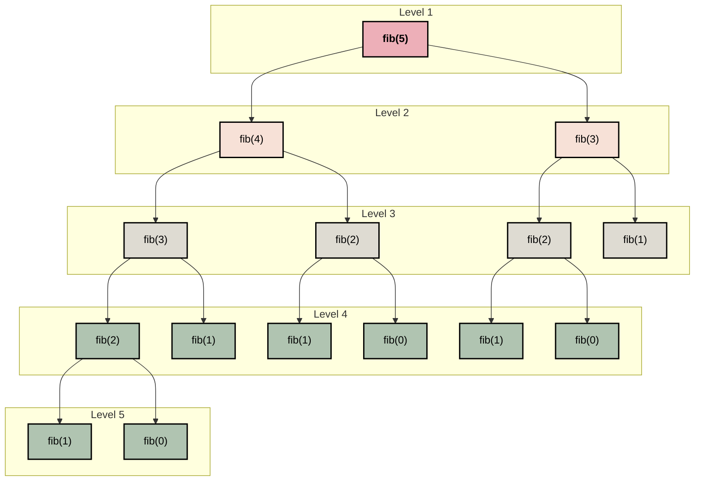

**Pseudocode: Fibonacci Iterative**
```text
1.  FUNCTION iterative_fib(n):
2. 	 IF n == 0:
3.         		RETURN 0
4.    	 ELSE IF n == 1:
5.         		RETURN 1
6.    	 END IF
7.     	first_term = 0
8.     	second_term = 1
9.     	FOR i FROM 2 TO n:
10.        		calculation = first_term + second_term
11.        		first_term = second_term
12.        		second_term = calculation
13.    	END FOR
14.   	 RETURN calculation
```

**Proof: Fibonacci Iterative**
> Let $T(n)$ be $O(n)$ if and only if $\exists c, \forall n \ge n_0$ such that $T(n)\le c \cdot g(n)$
> 
> $$
> \begin{align*}
c \cdot g(n) &\ge T(n) \\
c \cdot g(n) &\ge (n-1)*3 + 4 \\
c \cdot g(n) &\ge 3\cdot n - 3 + 4 \\
c \cdot g(n) &\ge 3\cdot n + 1
> \end{align*}
> $$
>
> We can now choose $c=4$ and $n_0=1$, and by definition prove that:
> 
> $$
> \begin{align*}
> T(n) &\le c \cdot g(n) \\
> 3\cdot n + 1 &\le 4 \cdot n \\
> \therefore T(n) &= O(n)
> \end{align*}
> $$


__Recurrence Tree for Fibonacci Recursive:__



**Proof: Recursive Fibonacci**
> We first simplify the recursive formula with the following relationship:
> $$
> T(n-1) + T(n-2) + c \lt 2 \cdot T(n-1) + c
> $$
>
> Expanding recursively:
> $$
> \begin{align}
> &2 \cdot T(n-1) + c \
> &2 \cdot (2 \cdot T(n-2) + c) + c \
> &4 \cdot T(n-2) + 3c \
> &4 \cdot (2 \cdot T(n-3) + c) + 3c \
> &\cdots \
> &2^k \cdot T(n-k) + (2^k - 1) \cdot c
> \end{align}
> $$
>
> Let $k = n$:
> $$
> \begin{align}
> T(n) &= 2^n \cdot T(0) + (2^n - 1) \cdot c \
> &= 2^n + 2^n c - c \
> &= 2^n (1 + c) - c
> \end{align}
> $$
>
> Dropping constants:
> $$
> \therefore T(n) = O(2^n)
> $$
>
> *(Source: [Syed Tousif Ahmed, Medium](https://syedtousifahmed.medium.com/fibonacci-iterative-vs-recursive-5182d7783055))*

__Pseudocode Fibonacci Recursive:__
```text
1.  FUNCTION recursive_fib(n):
2.      IF n <= 1:
3.          RETURN n
4.      result = recursive_fib(n - 1) + recursive_fib(n - 2)
5.      RETURN result
```