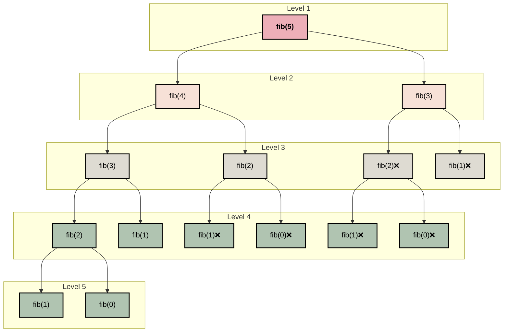

|                         |   ('Time_Elsaped', 'count') |   ('Time_Elsaped', 'mean') |   ('Time_Elsaped', 'std') |   ('Time_Elsaped', 'min') |   ('Time_Elsaped', '25%') |   ('Time_Elsaped', '50%') |   ('Time_Elsaped', '75%') |   ('Time_Elsaped', 'max') |   ('Operation_Count', 'count') |   ('Operation_Count', 'mean') |   ('Operation_Count', 'std') |   ('Operation_Count', 'min') |   ('Operation_Count', '25%') |   ('Operation_Count', '50%') |   ('Operation_Count', '75%') |   ('Operation_Count', 'max') |
|:------------------------|----------------------------:|---------------------------:|--------------------------:|--------------------------:|--------------------------:|--------------------------:|--------------------------:|--------------------------:|-------------------------------:|------------------------------:|-----------------------------:|-----------------------------:|-----------------------------:|-----------------------------:|-----------------------------:|-----------------------------:|
| ('C', 'Dynamic')        |                       11000 |                1.15966e-05 |               2.63837e-05 |                 6.8e-08   |               7.74075e-06 |               1.06725e-05 |               1.3357e-05  |                0.00191663 |                          11000 |                1752.49        |               1010.42        |                            2 |                       879.25 |                       1752.5 |               2625.75        |               3499           |
| ('C', 'Iterative')      |                       11000 |                4.76835e-07 |               4.17471e-07 |                 7.9e-08   |               3.05e-07    |               4.73e-07    |               6.36e-07    |                3.1316e-05 |                          11000 |                 751.496       |                433.038       |                            1 |                       377.25 |                        751.5 |               1125.75        |               1500           |
| ('C', 'Recursive')      |                         858 |                0.0359045   |               0.102887    |                 8.1e-08   |               9.895e-07   |               5.83455e-05 |               0.00696208  |                0.552923   |                            858 |                   4.12176e+07 |                  1.18146e+08 |                            2 |                       530    |                      65672   |                  8.07761e+06 |                  6.14005e+08 |
| ('Python', 'Dynamic')   |                       16000 |                8.3477e-05  |               5.42594e-05 |                 7.153e-07 |               4.26769e-05 |               8.15392e-05 |               0.000125885 |                0.00179601 |                          16000 |                1752.49        |               1010.41        |                            2 |                       879.25 |                       1752.5 |               2625.75        |               3499           |
| ('Python', 'Iterative') |                       16000 |                1.11417e-05 |               6.52695e-06 |                 7.153e-07 |               6.1989e-06  |               1.07288e-05 |               1.57356e-05 |                0.000211   |                          16000 |                 751.498       |                433.029       |                            2 |                       377.25 |                        751.5 |               1125.75        |               1500           |
| ('Python', 'Recursive') |                         768 |                0.000958152 |               0.00205632  |                 7.153e-07 |               4.53e-06    |               3.99351e-05 |               0.000581384 |                0.0097456  |                            768 |               49100           |             106135           |                            2 |                       110    |                       1826   |              28958           |             450146           |


**Pseudocode: Fibonacci Iterative**
```text
1.  FUNCTION iterative_fib(n):
2. 	 IF n == 0:
3.         		RETURN 0
4.    	 ELSE IF n == 1:
5.         		RETURN 1
6.    	 END IF
7.     	first_term = 0
8.     	second_term = 1
9.     	FOR i FROM 2 TO n:
10.        		calculation = first_term + second_term
11.        		first_term = second_term
12.        		second_term = calculation
13.    	END FOR
14.   	 RETURN calculation
```

**Proof: Fibonacci Iterative**
> Let $T(n)$ be $O(n)$ if and only if $\exists c, \forall n \ge n_0$ such that $T(n)\le c \cdot g(n)$
> 
> $$
> \begin{align*}
c \cdot g(n) &\ge T(n) \\
c \cdot g(n) &\ge (n-1)*3 + 4 \\
c \cdot g(n) &\ge 3\cdot n - 3 + 4 \\
c \cdot g(n) &\ge 3\cdot n + 1
> \end{align*}
> $$
>
> We can now choose $c=4$ and $n_0=1$, and by definition prove that:
> 
> $$
> \begin{align*}
> T(n) &\le c \cdot g(n) \\
> 3\cdot n + 1 &\le 4 \cdot n \\
> \therefore T(n) &= O(n)
> \end{align*}
> $$


__Recurrence Tree for Fibonacci Recursive:__

```mermaid
graph TD
    classDef level0 fill:#edafb8,stroke:#000000,color:#000000,stroke-width:2px,font-weight:bold;
    classDef level1 fill:#f7e1d7,stroke:#000000,stroke-width:2px,color:#000000;
    classDef level2 fill:#dedbd2,stroke:#000000,stroke-width:2px,color:#000000;
    classDef level3 fill:#b0c4b1,stroke:#000000,stroke-width:2px,color:#000000;
    classDef level4 fill:#b0c4b1,stroke:#000000,stroke-width:2px,color:#000000;
    
    subgraph "Level 1"
        F5["fib(5)"]:::level0
    end

    subgraph "Level 2"
        F4["fib(4)"]:::level1
        F3["fib(3)"]:::level1
        F5 --> F4
        F5 --> F3
    end

    subgraph "Level 3"
        F3b["fib(3)"]:::level2
        F2a["fib(2)"]:::level2
        F4 --> F3b
        F4 --> F2a
        F2b["fib(2)"]:::level2
        F1c["fib(1)"]:::level2
        F3 --> F2b
        F3 --> F1c
    end

    subgraph "Level 4"
        F2b1["fib(2)"]:::level3
        F1b["fib(1)"]:::level3
        F3b --> F2b1
        F3b --> F1b

        F1a["fib(1)"]:::level3
        F0a["fib(0)"]:::level3
        F2a --> F1a
        F2a --> F0a

        F1b2["fib(1)"]:::level3
        F0b["fib(0)"]:::level3
        F2b --> F1b2
        F2b --> F0b
    end

    subgraph "Level 5"
        F1x["fib(1)"]:::level4
        F0x["fib(0)"]:::level4
        F2b1 --> F1x
        F2b1 --> F0x
    end
```



**Proof: Recursive Fibonacci**
> We first simplify the recursive formula with the following relationship:
> $$
> T(n-1) + T(n-2) + c \lt 2 \cdot T(n-1) + c
> $$
>
> Expanding recursively:
> $$
> \begin{align}
> &2 \cdot T(n-1) + c \
> &2 \cdot (2 \cdot T(n-2) + c) + c \
> &4 \cdot T(n-2) + 3c \
> &4 \cdot (2 \cdot T(n-3) + c) + 3c \
> &\cdots \
> &2^k \cdot T(n-k) + (2^k - 1) \cdot c
> \end{align}
> $$
>
> Let $k = n$:
> $$
> \begin{align}
> T(n) &= 2^n \cdot T(0) + (2^n - 1) \cdot c \
> &= 2^n + 2^n c - c \
> &= 2^n (1 + c) - c
> \end{align}
> $$
>
> Dropping constants:
> $$
> \therefore T(n) = O(2^n)
> $$
>
> *(Source: [Syed Tousif Ahmed, Medium](https://syedtousifahmed.medium.com/fibonacci-iterative-vs-recursive-5182d7783055))*

__Pseudocode Fibonacci Recursive:__
```text
1.  FUNCTION recursive_fib(n):
2.      IF n <= 1:
3.          RETURN n
4.      result = recursive_fib(n - 1) + recursive_fib(n - 2)
5.      RETURN result
```


__Recursion Tree Fibonacci Dynamic:__



__Pseudocode Fibonacci Dynamic:__
```text
FUNCTION calculate_dyanmic_fib(n, memo):
    IF n <= 1:
        RETURN n
    IF memo[n] != 0:
        RETUNRN memo[n]
    memo[n] = calculate_dyanmic_fib(n-1, memo) + calculate_dyanmic_fib(n-2, memo)
    RETURN memo[n]

FUNCTION dynamic_fib(n):
    memo = [0] * n
    result = calculate_dyanmic_fib(n, memo):
    RETURN result
```
__Recursion Tree Fibonacci Dynamic:__


__Dynamic Proof:__
>Let $T(n)$ be $O(n)$ if and only if $\exists c, \forall n \ge n_0$ such that $T(n)\le c \cdot g(n)$. 
> 
> Our equation,
> $$T(n) = n + c$$
>We drop our constansts and choose $c=1$ and $n_0=1$, and prove by defintion that:
> $$ n \le n $$
> $$ \therefore T(n) = O(n) $$


